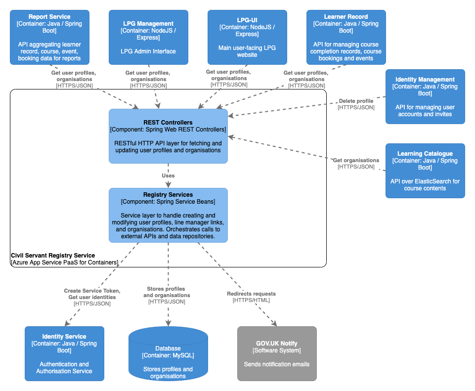

# Civil Servant Registry Service

## Purpose

Civil Servant Registry Service, aka 'CSRS' is a Spring Boot based RESTful API for managing user profile & personal data (e.g. name, grade, profession), linking users in line manager relationships, and holding organisation data (e.g. organisational units, parent/child orgs, agency tokens). Profile and org data is stored in MySQL. CSRS is called by LPG-UI and LPG-Management to view, create and update profile and organisation data, and is also called by most other API services to fetch profile data such as a user's line manager or organisation, or organisation relationships.

## Component overview

See the `diagram/` folder for diagram source in draw.io XML format

## Dependencies

### Build-time

For a complete list of build dependencies check the `build.gradle` file. The main source dependencies are:  
- Spring Boot 2.0 (web, jetty, jersey, security, config)
- Spring Security OAuth2 2.3.3
- Spring Data REST 3.0
- Spring Data JPA 2.0
- Azure App Insights 2.5
- AspectJ 1.9
- h2 1.4
- Hibernate 5.2
- Flyway 5.0
- Mysql connector 8.0

### Test-time

For a complete list of test dependencies check the `build.gradle` file. The main test dependencies are:  
- Spring Boot Starter Test
- Spring Boot Security Test
- mockito 2.8
- powermock 1.7

### Runtime 

#### Other LPG Services

- `identity-service` for getting user identity details and creating service tokens to make inter-component requests

#### External integrations

- GOV.UK Notify to inform a user when they have been set as line manager by another user

#### Data Stores

- MySQL <version> for CRUD actions on civil servant profile and organisation data

#### Data migrations

The CSRS application uses Flyway to manage the DB migrations inside its own schema. See the `src/main/resources/db/migration` folder. Note: in-memory H2 DB has a separate migration folder than the deployed target MySQL DB - changes must be made to both in order to run successfully when deployed to the real environments.

#### Caching

The CSRS application is one of few application components in LPG that has explicit caching. The caching implemented is using the `@Cacheable` annotation in the `OrganisationalUnitController` and caches both the endpoint results for the Tree and Flat versions of the organisations hierarchy. The cache is evicted on calls to save and delete in the `OrganisationalUnitRepository`. 

## Build, run, test, deploy

The application requires Java 8 (OpenJDK 8) installed to build and run.

Build the application using Gradle `./gradlew build`.

Run the project with `./gradlew bootRun` or import the project into your IDE of choice such as IntelliJ or VS Code use the IDE commands to Run Application.

Run the unit tests using `./gradlew test` or choose individual test classes or packages using your IDE.

The application is packaged as a docker container image and includes an Azure App Insights Java agent for collecting metrics from the app - see `Dockerfile` in the root directory for the container definition. `hammer` is the log collector used for aggregating log output.

The application also inclues a `Jenkinsfile` to define the Jenkins build pipeline stages and linking it to the docker image repository and correct terraform module.

Deployment is controlled via the Terraform scripts in the main PaaS repository, with per-environment configuration values referenced there and secrets injected from keybase.

## Configuration

Significant configuration properties are highlighted here. For the full configuration file see `src/main/resources/application.yml`

- `oauth` connection settings for the identity-service used to create auth tokens
- `spring.datasource` connection settings for MySQL database
- `govNotify` credentials and template reference for the GOV.UK client library

## Licenses

CSRS is licensed by the MIT license, see `LICENSE` in the root folder for details. Dependent applications are licensed as according to their respective readme and license files.
